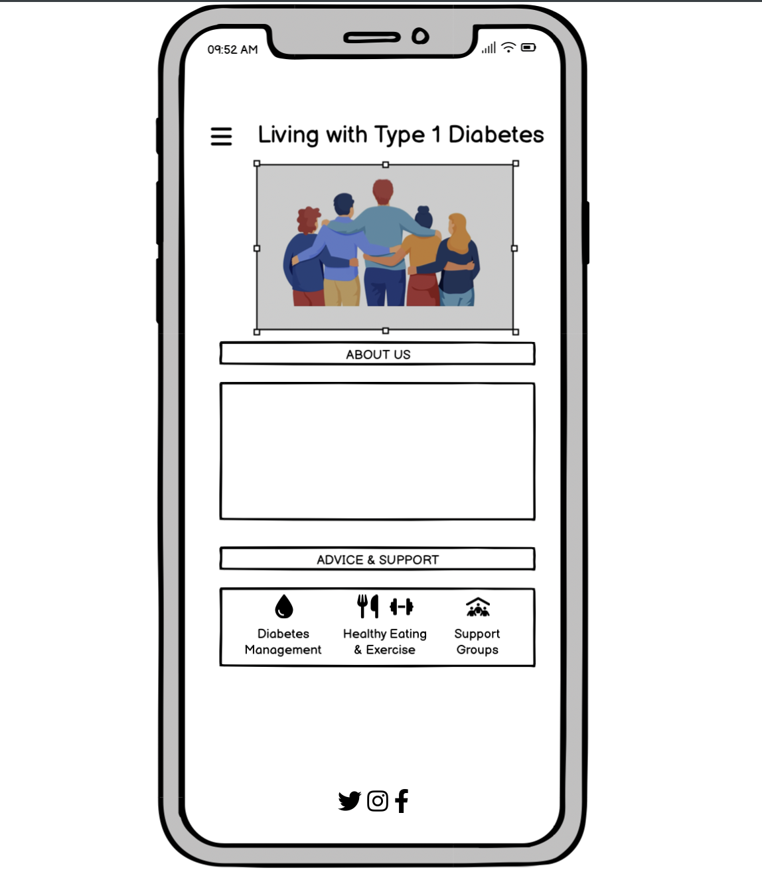

# Living with Type 1 Diabetes

Living with Type 1 Diabetes is a fictional website which provides information, advice, and support to Type 1 Diabetics.

It provides a clear and simple means for Type 1 Diabetics to navigate the complexities of information available in relation to the daily management of their condition and the pracitical guidance they require. The website also provides an opportunity for users to sign-up to join one of the three Peer Support Groups operating across Ireland so as to meet with other Type 1 Diabetics, share their experiences and learn from one another.

The purpose of this website is to promote the Living with Type 1 Diabetes organisation and to provide information to the users of the site including; advice on daily diabetes management; blood glucose monitoring; nutrion; and exercise. The website primarily targets an audience of newly diagnosed diabetics looking for the key points of information during their intial diagnosis, though as diabetes is a lifeling condition, the information and guidance contained in the website is required by all diabetics.  

Visit the deployed website [here](https://oneill-aoifesarah.github.io/living-with-type-one-diabetes/index.html)

## Table of Contents

1. [User Experience (UX)](#user-experience-ux)
    1. [Project Goals](#project-goals)
    2. [User Stories](#user-stories)
    3. [Color Scheme and Icons](#color-scheme-and-icons)
    5. [Typography](#typography)
    6. [Wireframes](#wireframes)
2. [Features](#features)
    1. [General](#general)
    2. [Landing Page](#landing-page)
    3. [Advice Page](#advice-page)
    4. [Support Page](#support-page)
 3. [Technologies Used](#technologies-used)
    1. [Languages Used](#languages-used)
    2. [Frameworks, Libraries and Programs Used](#frameworks-libraries-and-programs-used)
4. [Testing](#testing)
    1. [Testing User Stories](#testing-user-stories)
    2. [Code Validation](#code-validation)
    3. [Accessibility](#accessibility)
    4. [Tools Testing](#tools-testing)
    5. [Manual Testing](#manual-testing)
5. [Finished Product](#finished-product)
6. [Deployment](#deployment)
    1. [GitHub Pages](#github-pages)
7. [Credits](#credits)
    1. [Content](#content)
    3. [Code](#code)
8. [Acknowledgements](#acknowledgements)

***

## User Experience (UX)

### Project Goals

* Present key points of information in relation to the "holy trinity" of diabetes management; blood glucose monioring; nutrition & exercise; and peer support; in a clear and accesible manner.

* Provide the user with links to the organisations social media accounts and address to facilitate possible future engagement and interaction with the organisation.

* Providee the user with the opportunity to register their details online to join the organisation's network of peers. 

### User Stories

* As a user, I want to be able to navigate the website easily and obtain access to key points of information.

* As a user, I want to be able to access information which is clear, concise, and addresses my needs.

* As a user, I want to be able to easily access information on who the organisation is and the purpose of the website.

* As a user, I want to find details of where the organisation is located.

* As a user, I want to be provided with social media links to the organisation's social-media should i wish to learn more and/or follow their platforms

* As a user, I want to easily navigate information in easily accesible segments. 

### Color Scheme and Icons

The colors utilised throughout are easily recogniable as the official color of diabetes campaigns (blues and pinks). This ensures that the user can easily relate to the purpose of the website upon inital review. To ensure the website remains welcoming, peaceful, and retains engamenet of the user, I utilised a pastel color scheme to ensure a calming environment for visitors to the site, complementing the pastel blues with a combination of light pinks and yellows so that the color scheme and appealability of the website was mainated. Text color complemented and added dimmension to the background color formats, with variations of white, yellow, blue, and pastel purples utilised throughout.

Iconography, obtained from favicon, aligned images to the key text contained within relevant sections. This included an image of a cutlery set (corresponding with information on nutrition); a droplet image (corresponding with blood glucose testing and monitoring information); and an image of a dumbbell (corresponding with exercise information).

### Typography

Typography utilised were soft formated text styles including Open Sans and Roberto. This ensured the format of text retained the desired impact when compiled with relevant color schemes.

### Wireframes

[Balsamiq](https://balsamiq.com/) was utilised in the visualisation of the project during my inital concept stages, a three page Balsamiq wireframe was developed to support in obtaining a baseline overview of what it was intended I wished to obtain.

The idea evolved with time, notably with additions of video and maps to support the overall develppment of the project in line the project goals and user experience objectives. 

[Back to top ⇧](#living-with-type-1-diabetes)

### General

* Responsive design across all device sizes.

* Similar color scheme and design throughout all pages to effectively structure, categorise and present the information to users.

* **Header**

    
    - The header contains the name of the website, logo and fully responsive navigation bar positioned across the top of the screen.

    - The organisation logo functions as a link to the landing page.

    - The navigation menu options are identical in all pages and contains links to all pages to facilitate navigation across the site. It also has a hover effect that underlines the element of the website which the user is on so as to encourage a better user experience.
      
    - For smaller devices, the navigation menu is replaced with an icon to allow the user to select from the drop down list, such as that displayed above. For larger devices, the navigation menu options display horizontally in a row and the icon is not utilised. 

* **Footer**

    - The footer includes links to the organisations' social media channels.

### Landing Page

* **Main Image**

    - The main image is designed to attract the users's attention and represents the nature of support and community surrounding the organisation.

* **Contact Section**

  - This section displays a Google map of the business' geographical location. This allows the customers to easily find the location from their devices.

[Back to top ⇧](#living-with-type-1-diabetes)

### Advice Page

  - A short video provides an overview of diabetes as an introduction to the content contained within this section.

- Simple bullet point information is contained within three sections titled 'Diabetes', 'Healthy Eating', and 'Exercise' and serve as the fundamental information required for diabetics in the management of their condition

### Support Page

- Users are provided with an opportunity to sign up to the Peer Support Groups
- Users are also able to avail of direct information of the next Peer Support Group meetind dates, times, and venues for ease of information and engagement.

## Technologies Used

### Languages Used
* [HTML5](https://en.wikipedia.org/wiki/HTML5)
* [CSS3](https://en.wikipedia.org/wiki/CSS)
* [JavaScript](https://en.wikipedia.org/wiki/JavaScript)

### Frameworks, Libraries and Programs Used

* [Google Fonts](https://fonts.google.com/)
    - Google Fonts was used to import the fonts Open Sans and Roboto into the style.css file. These fonts were used throughout the site.

* [Font Awesome](https://fontawesome.com/)
     - Font Awesome was used throughout to add icons in order to create a better visual experience for UX purposes.

* [TinyPNG](https://tinypng.com/)
    - TinyPNG was used to reduce the file size of the images for the website.

* [GitHub](https://github.com/)
     - GitHub was used to store the project after pushing.

* [Balsamiq](https://balsamiq.com/)
     - Balsamiq was used to create the wireframes during the design phase of the project.

* [Responsive Design Checker](https://www.responsivedesignchecker.com/)
    - Responsive Design Checker was used in the testing process to check responsiveness on various devices.

* [Chrome DevTools](https://developer.chrome.com/docs/devtools/)
    - Chrome DevTools was used during development process for code review and to test responsiveness.

* [W3C Markup Validator](https://validator.w3.org/)
    - W3C Markup Validator was used to validate the HTML code.

* [W3C CSS Validator](https://jigsaw.w3.org/css-validator/)
    - W3C CSS Validator was used to validate the CSS code.
    
* [WebAIM Contrast Tracker]([https://validator.w3.org/](https://webaim.org/resources/contrastchecker/))

[Back to top ⇧](#living-with-type-1-diabetes)

## Testing

### Testing User Stories

* As a user, I want to be able to navigate the website intuitively and learn more about the organisation and supports being offered.

     - The website offers a intuitive structure for the user to navigate and find the information, support, and advice they are looking for.

    - The navigation bar is clearly presented in all pages for the user to find with ease and it is easily navigable.

* As a user, I want to be able to read more about the diabetes and management of the same, in a clear and simple manner.

    - The advice page presents sections of tips and pointers on health, exercise, and diabetes management, each clearly identified within their own section.

    - Each section contains useful information in line with the relevant subject matter.

* As a user, I want to easily find where the organisation is based.

    - The landing page contains a google maps section detailing the precise location and address of the organnisation. 

* As a user, I want to find social media links to the organisation to see what else they offer.

    - The footer provides link to the organisations' social media channels.

* As a user, I want to be able to link in with the support groups directly from the website.

    - The support now page provides a signup form for the user to register their details for the support groups. The details of the location, time, date, and County of the upcoming Peer Support Group Meetings are also included for ease of reference for the user.

### Code Validation

* The [W3C Markup Validator](https://validator.w3.org/) and [W3C CSS Validator](https://jigsaw.w3.org/css-validator/) services were used to validate all pages of the project in order to ensure there were no syntax errors.

* W3C Markup Validator found some errors errors in relation to p elements beign outside of scope. There were also information points flagged in terms of trailing slash elements and tags.
[HTML Validator Errors image](assets/images/readme-images/w3-validator-html-errors.png)

* I manually revised the relevant sections, restructruing the layout of my code so that any open and end tags were clearly identifiable and structured accordingly in their correct sections. Following this, I ran the W3C html Validator again and  no errors were found.
[HTML Validator Passed image](assets/images/readme-images/w3-validator-html-passed.png)

* W3C CSS Validator was utilised to validate my CSS code. a warning pertaining to the use of the import function in my css and inability for the W3C CSS Validator to validate the same, was noted. As this was an anticipcated return and does not effect the standing of my CSS, I simply acknowledged receipt of this warning. Upon further re-validation of my CSS code, the W3C CSS Validator passed succesfully
[CSS Validator Passed image](assets/images/readme-images/w3-validator-css-passed.png)

### Accessibility

* Used Lighthouse in Chrome DevTools to confirm that the colors and fonts being used in throughout the website are easy to read and accessible. Suggestions werre made to revisit the contrast of colours utilised, therefore I revisted the same utilsing the WebAIM Contrast Tracker and altered the shade and font weight of both the container colours (HEX #f9efe7) and the h3 element colour (HEX #7777ff)

* Lighthouse reports

    

### Tools Testing

* [Chrome DevTools](https://developer.chrome.com/docs/devtools/)

    - Chrome DevTools was used during the development process to test, explore and modify HTML elements and CSS styles used in the project.

* Responsiveness
    
    - [Am I Responsive?](http://ami.responsivedesign.is/#) was used to check responsiveness of the site pages across different devices.

    - [Responsive Design Checker](https://www.responsivedesignchecker.com/) was used to check responsiveness of the site pages on different screen sizes.
    
    - Chrome DevTools was used to test responsiveness in different screen sizes during the development process.

### Manual Testing

* Browser Compatibility

    - The website has been tested on the following browsers:

        - **Google Chrome**
        
        No appearance, responsiveness nor functionality issues.

        - **Safari**
        
        No appearance, responsiveness nor functionality issues.

        - **Mozilla Firefox**
        
        
        No responsiveness nor functionality issues.

        - **Microsoft Edge**
        
        No appearance, responsiveness nor functionality issues.

* Device compatibility

    - The website has been tested on multiple devices, including:

        - **MacBook Air 2022"**

        No appearance, responsiveness nor functionality issues.

        - **Lenovo ThinKpad T480**

        No appearance, responsiveness nor functionality issues.

        - **iPhone 13**
        
        No appearance, responsiveness nor functionality issues.

* Common Elements Testing

    - All Pages
        
        - **Header**

            - Clicking on the main logo will bring the customer back to the landing page.

        - **Navigation Bar**

            - Hovering on the different navigation bar's links will trigger hover effect, highlighting the link for the user.

            - Clicking on the navigation bar's links will bring the user to the specified page.
        
        - **Footer**
        
            - Clicking on the social media links will open the specific website on a new tab.

    - Advice Page
      
       - Clicking the play icon on the video embedded in the Advice page will play a brief introduction on what Diabetes is and sets the scene for the details enclosed in this section.
  
    - Support Page

        - When filling out the sign up form, the user is invited to enter their name and email address before submitting.
        
        - An acknowledgement message is displayed once the user has submitted their details following the selection of the 'Sign-Up' button.

[Back to top ⇧](#pura-vida-spa)

## Finished Product

Page | Desktop version | Mobile version
--- | --- | ---
Index |  | 
Treatments |  | 
Book Now |  | 
404 Error |  | 

[Back to top ⇧](#living-with-type-1-diabetes)

## Deployment

* This website was developed using [Code Anywhere](https://app.codeanywhere.com/), which was then committed and pushed to GitHub using the terminal.

### GitHub Pages

* Here are the steps to deploy this website to GitHub Pages from its GitHub repository:

    1. Log in to GitHub and locate the [GitHub Repository](https://github.com/).

    2. At the top of the Repository, locate the Settings button on the menu.

    3. Scroll down the Settings page until you locate the Pages section.

    4. Under Source, click the dropdown called None and select Master Branch.

    6. The page will refresh automatically and generate a link to your website. The link to your deployed page can be located in the right-hand side of the 'Code' section on your Github page. 

[Back to top ⇧](#living-with-type-1-diabetes)

## Credits 

### Content

- All content was written by the developer.

### Code

* [Stack Overflow](https://stackoverflow.com/) and [W3Schools](https://www.w3schools.com/) were consulted on a regular basis for inspiration and sometimes to be able to better understand the code being implement.

[Back to top ⇧](#living-with-type-1-diabetes)

## Acknowledgements

* My tutor, Marcel, for his invaluable feedback and guidance.

* Code Institute and its Slack community for their support and providing me with the necessary knowledge to complete this project.

[Back to top ⇧](#living-with-type-1-diabetes)
